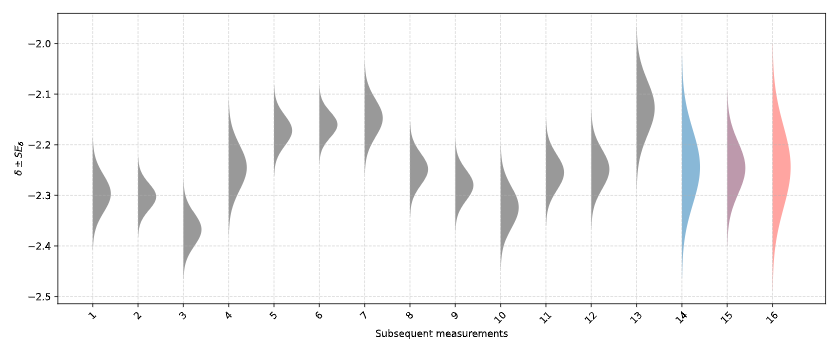
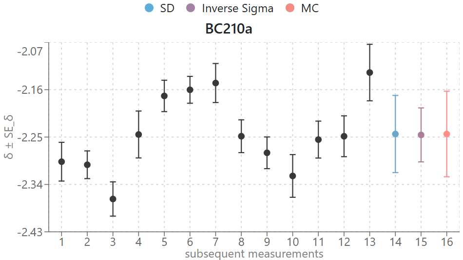

#  SpecTrust

**SpecTrust** is a web-based application developed for the quantitative analysis and visualization of isotopic measurement uncertainty. It implements statistically rigorous methods—including bracketing-based δ (delta) value computation, uncertainty propagation, inverse-variance weighting, and Monte Carlo simulation—to provide researchers with reproducible, interpretable metrics of analytical precision. The platform supports both manual and batch (CSV-based) data entry and outputs numerical results alongside violin plots and scatter plots for comparative uncertainty assessment. Spec-Trust is designed to enhance transparency and consistency in isotopic data evaluation workflows.

**Live App**: https://spec-trust.vercel.app

---

## Key features

### Automated Delta and Uncertainty Calculations
- Calculates δ values using bracketing method according to the following equation
$$\delta_s (\permil) = \left[ \frac {\left( \frac{^{82}\text{Se}}{^{78}\text{Se}} \right)_s} {\frac{1}{2} \left( \left( \frac{^{82}\text{Se}}{^{78}\text{Se}} \right)_{b_1} + \left( \frac{^{82}\text{Se}}{^{78}\text{Se}} \right)_{b_2} \right)} - 1 \right] \times 1000$$
Where:
  - $\left( \frac{^{82}\text{Se}}{^{78}\text{Se}} \right)_s$ is the measured isotope ratio of the sample
  - $\left( \frac{^{82}\text{Se}}{^{78}\text{Se}} \right)_{b_1}$ and $\left( \frac{^{82}\text{Se}}{^{78}\text{Se}} \right)_{b_2}$ are the measured isotope ratios of the two bracketing standards
  
  The result is multiplied by 1000 to express the deviation in parts per thousand (‰).


- Computes propagated standard error SE(δ) using

    $$
    SD_\delta \approx 10^3 \cdot \left| \frac{2 \cdot \mu_s}{\mu_{b_1} + \mu_{b_2}} \right| \cdot \sqrt{ \left( \frac{\sigma_s}{\mu_s} \right)^2 + \left( \frac{ \sqrt{\sigma_{b_1}^2 + \sigma_{b_2}^2} }{ \mu_{b_1} + \mu_{b_2} } \right)^2 }
    $$
    Where:
    - $ \mu_{s} $ is the measured sample ratio
    - $ \mu_{b1}$, $ \mu_{b2} $ are the ratios of the bracketing standards
    - $ \sigma_{s} $, $ \sigma_{b1} $, $ \sigma_{b2} $ are their corresponding standard errors

### Statistical validation
**Shapiro–Wilk** test is applied to assess whether the distribution of δ values can be considered normally distributed. This evaluation supports the underlying statistical assumptions required for parametric analyses and model-based inference. The null hypothesis (H₀) assumes normality (Δ ∼ 𝒩), while the alternative hypothesis (H₁) suggests otherwise. A sufficiently high p-value indicates that δ values do not significantly deviate from a normal distribution.

### Uncertainty computation

The application implements three rigorous statistical approaches to summarize overall uncertainty in δ values:
    
- **Standard Deviation of δ** 

    A classic statistical measure that represents the spread of δ values around their mean. It captures the random variation inherent in repeated measurements without taking individual uncertainties into account.
- **Inverse-σ Weighted Mean**

  A precision-weighted average of δ values, where measurements with smaller standard errors contribute more heavily. This method yields a more robust central estimate when individual uncertainties vary substantially.
- **Monte Carlo Simulated Uncertainty**

  An empirical method that introduces simulated random noise based on each measurement’s standard error to generate synthetic δ datasets. The average spread of these datasets provides a realistic estimate of total uncertainty.

### Uncertainty visualization

- **Half violin plot** provides a visual representation of the distribution and spread of δ values and their associated uncertainties. Each violin is centered on a measurement and shaped according to a normal distribution defined by its δ and SE(δ). Summary uncertainty estimates (SD, Inverse Sigma, MC) are also plotted as color-coded violins for comparative purposes.
    <p align="center">
        
    </p>  

- **Scatter plot with error bars** displays δ values with vertical lines representing ± SE(δ). This plot allows users to assess consistency across measurements, identify outliers, and visually compare replicate data.
    <p align="center">
        
    </p>
 
  
## Step-by-Step Instructions
### 1. Launch the App
Visit https://spec-trust.vercel.app
### 2. Choose Input Method
- Click **Manual Entry** to enter values row by row or paste data from Excel file
- OR click **CSV Upload** to submit a `.csv` file formatted as described in the app

After uploading the data, the app will automatically begin processing. You’ll see a loading spinner while computations are running.

### 3. View Your Results
Explore the violin plot and scatter plot summarizing distribution and uncertainty.

Check the Shapiro-Wilk test result to assess normality.

Scroll to the interactive table to view all values per sample (δ, SE(δ)).

## Local Development Setup
### Backend (Django)
```
cd backend
python -m venv env
source env/bin/activate  # or env\Scripts\activate on Windows
pip install -r requirements.txt
python manage.py runserver
```
### Frontend (React)
```
cd spec-trust
yarn install
yarn dev
```
Open `http://localhost:5173` to view the app.

## Built With
- 🧩 React + Redux Toolkit
- 🎨 Bootstrap 5
- 📈 Matplotlib
- 🔙 Django 
- 🧪 Scipy, Pandas, NumPy

## License
This application is provided for academic and research use only. Redistribution, modification, or commercial use is not permitted without prior written permission from the author.