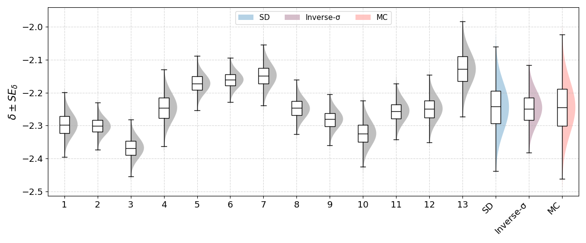
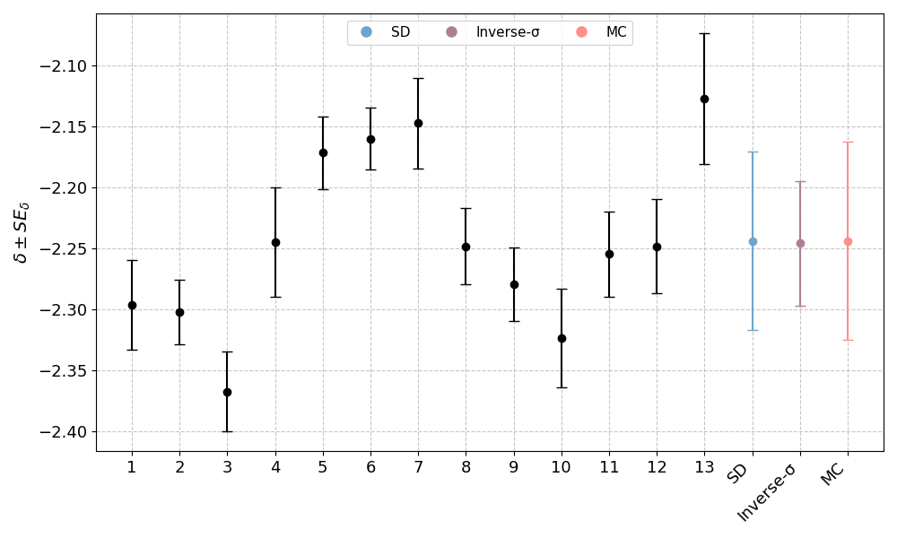

#  SpecTrust

**SpecTrust** is a web-based application developed for the quantitative analysis and visualization of isotopic measurement uncertainty. It implements statistically rigorous methods—including bracketing-based δ (delta) value computation, uncertainty propagation, inverse-variance weighting, and Monte Carlo simulation—to provide researchers with reproducible, interpretable metrics of analytical precision. The platform supports both manual and batch (CSV-based) data entry and outputs numerical results alongside violin plots and scatter plots for comparative uncertainty assessment. Spec-Trust is designed to enhance transparency and consistency in isotopic data evaluation workflows.

**Live App**: https://spec-trust.vercel.app

---

## Key features

### Automated Delta and Uncertainty Calculations
- Calculates δ values using bracketing method according to the following equation
  <p>
    
  </p>
  
- Computes propagated standard error SE(δ) using
  <p>
    
  </p>


### Statistical validation
**Shapiro–Wilk** test is applied to assess whether the distribution of δ values can be considered normally distributed. This evaluation supports the underlying statistical assumptions required for parametric analyses and model-based inference. The null hypothesis (H₀) assumes normality (Δ ∼ 𝒩), while the alternative hypothesis (H₁) suggests otherwise. A sufficiently high p-value indicates that δ values do not significantly deviate from a normal distribution.

### Uncertainty computation

The application implements three rigorous statistical approaches to summarize overall uncertainty in δ values:
    
- **Standard Deviation of δ** 

  A classic statistical measure that quantifies the spread of δ values around their mean. It reflects the total random variability observed across repeated measurements, without considering the individual standard errors associated with each measurement. This method is straightforward but assumes that all δ values have comparable uncertainties.
- **Inverse-σ Weighted Mean**

  This method is an adaptation of the inverse-variance weighted average approach. Instead of using the inverse of the variance (σ²) for weighting, it uses the inverse of the standard deviation (σ). Each δ value is weighted by the reciprocal of its standard deviation, meaning measurements with lower uncertainties contribute more to the final mean. This adjustment improves numerical stability when working with very small δ values and uncertainties, as is common in high-precision isotopic measurements.
- **Monte Carlo Simulated Uncertainty**

  The Monte Carlo approach creates a large number of synthetic datasets by repeatedly adding random noise (drawn from a normal distribution with a standard deviation equal to each measurement's standard error) to the δ values. For each synthetic dataset, a standard deviation of δ values is calculated. After many iterations (e.g., 10,000 simulations), the average of these simulated standard deviations is taken as the Monte Carlo estimate of the total measurement uncertainty.

### Uncertainty visualization

- **Half violin plot** provides a visual representation of the distribution and spread of δ values and their associated uncertainties. Each violin is centered on a measurement and shaped according to a normal distribution defined by its δ and SE(δ). Summary uncertainty estimates (SD, Inverse Sigma, MC) are also plotted as color-coded violins for comparative purposes.
    <p align="center">
        
    </p>  

- **Scatter plot with error bars** displays δ values with vertical lines representing ± SE(δ). This plot allows users to assess consistency across measurements, identify outliers, and visually compare replicate data.
    <p align="center">
        
    </p>
 
### Exemplary datasets
All of our exemplary datasets can be found  [here](https://drive.google.com/drive/u/2/folders/1DtlCLSTYBFxZo53G3e6bvQxm-fFPMsSm).
- **BC10a**- based on selenium isotope ratio measurements (⁸²Se/⁷⁸Se) in wheat flour reference material certified for selenium content,
- **asw_selenium**- selenium isotope ratio data measured in artificial seawater matrix, prepared for selenium-specific analysis,
- **asw_uranium**- uranium isotope ratio data (²³⁵U/²³⁸U) measured in a separate artificial seawater matrix, tailored for uranium analysis,
- **water_sample**- natural water samples (1 and 2) analyzed after uranium separation; used to assess recovery and matrix effects,
- **ume2**- uranium isotope ratio data from the UME2 certified standard, a well-characterized uranium reference material,
- **u3o8**- solid uranium oxide (U₃O₈) samples analyzed for both uranium content and isotopic composition.

## Step-by-Step Instructions
### 1. Launch the App
Visit https://spec-trust.vercel.app
### 2. Choose Input Method
- Click **Manual Entry** to enter values row by row or paste data from Excel file
- OR click **CSV Upload** to submit a `.csv` file formatted as described in the app

After uploading the data, the app will automatically begin processing. You’ll see a loading spinner while computations are running.

### 3. View Your Results
Explore the violin plot and scatter plot summarizing distribution and uncertainty.

Check the Shapiro-Wilk test result to assess normality.

Scroll to the interactive table to view all values per sample (δ, SE(δ)).

## Local Development Setup
### Backend (Django)
```
cd backend
python -m venv env
source env/bin/activate  # or env\Scripts\activate on Windows
pip install -r requirements.txt
python manage.py runserver
```
### Frontend (React)
```
cd spec-trust
yarn install
yarn dev
```
Open `http://localhost:5173` to view the app.

## Built With
- 🧩 React + Redux Toolkit
- 🎨 Bootstrap 5
- 📈 Matplotlib
- 🔙 Django 
- 🧪 Scipy, Pandas, NumPy

## License
This application is provided for academic and research use only. Redistribution, modification, or commercial use is not permitted without prior written permission from the author.